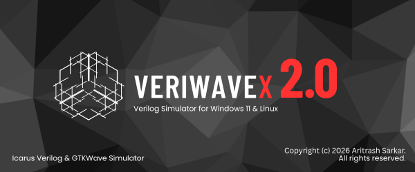

# VeriWaveX - beta v1.0
> **A Modern, Portable Verilog IDE for Computer Architecture Labs.**

---

## Overview
**VeriWaveX** is a lightweight, portable Integrated Development Environment (IDE) designed specifically for students and engineers working in Computer Architecture Labs. It eliminates the frustration of environment setup by bundling the **Icarus Verilog** compiler and **GTKWave** waveform viewer into a single, cohesive Windows application.

Built with **Rust** and the **egui** framework, VeriWaveX offers a high-performance, GPU-accelerated interface that works right out of the box.

---

## Key Features

- **One-Click Simulation**: Write your code and launch GTKWave instantly without touching the command line.
- **Project Management**: Save your work using the custom `.vwx` project format to keep source files and testbenches organized.
- **File Creation Wizard**: 
    - **Module Wizard**: Define your input/output pins and auto-generate Verilog boilerplate.
    - **Testbench Wizard**: Automatically generates `$dumpfile` and `$dumpvars` hooks—no more "empty waveform" errors.
- **Integrated Console**: Real-time syntax error reporting directly from the Icarus engine.
- **Modern UI**: A clean, distraction-free environment featuring the community-favorite **Gruvbox** color theme.

---

## Built With

* [Rust](https://www.rust-lang.org/) - Core logic and systems orchestration.
* [eframe/egui](https://github.com/emilk/egui) - Hardware-accelerated Immediate Mode GUI.
* [Icarus Verilog](http://iverilog.icarus.com/) - The simulation engine.
* [GTKWave](http://gtkwave.sourceforge.net/) - The waveform visualization tool.

---

## Getting Started

### Installation
1. Navigate to the [Releases](https://github.com/your-username/veriwavex/releases) page.
2. Download `VeriWaveX_Setup.exe`.
3. Run the installer (If Windows SmartScreen appears, click *More Info* -> *Run Anyway*).
4. Launch **VeriWaveX** from your Desktop.

### Your First Simulation
1. Click **Create New Project** and select a folder.
2. Use the **New File** button to create a Module (e.g., `and_gate`).
3. Use the wizard again to create a **Testbench** for that module.
4. Hit **Simulate** and watch your waveforms appear!

---

## Contributing
Currently there is no scope of contributing, but in future there might be.

**Developed with ❤️ by [Aritrash Sarkar](https://github.com/your-username)** *Innovation Ambassador | CSE Student | Lead at The Darkness Factor*

---
### License
This project is licensed under the **Apache License 2.0** - see the [LICENSE](LICENSE) file for details.